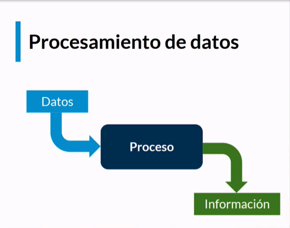
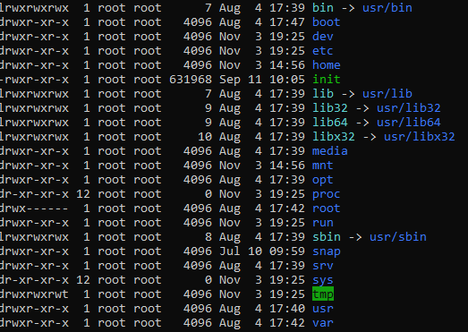
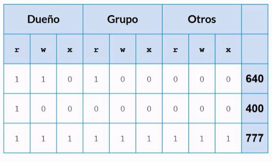

# Curso de introducción a la terminal y lineas de comando

# 1. Introducción.
En este curso vamos aprender lo siguiente:
- Qué es la terminal.
- Por qué usar la terminal.
- Cómo usar la terminal.
- Cómo aprovechar la terminal al maximo.

## 1.1. ¿Que es y como funciona la terminal?
Para empezar vamos a explicar que es una computadora (a grandes rasgos), en una computadora tenemos memoria, en esa memoria se almacenan instrucciones yu algunos datos, lo que hace la computadora es revisar periodicamente esa memoria, levantar una instrucción, ejecutarla y guardar los resultados (eso se repite constantemente).
La computadora tiene un lenguaje unico que no es complatible con nuestro lenguajes, es por esto que tenemos una terminal, algo asi como un intermediario entre la computadora y nosotros. Lo mismo que se puede realizar en una interfaz grafica se puede ejecutar en una terminal.

### Los comandos.
Un comando consiste en:
- Nombre del programa.
- Parámetros.
- Modificadores.

La diferencia entre los parametros y los modificadores, es que los modificadores alteran una instrucción y los parametros son simplemente información adicional para la ejecución de un programa.

```
comando -flag1 -flag2 -arg1 -arg2 
```

Vamos a ver unos comandos:
- date: muestra la fecha de hoy.
- echo "mensaje": muestra un mensaje en la pantalla
- man: es un manual que muestra información de un comando, por ejemplo **man date**
- history: muestra el historial de todos los comandos escritos.
- !hash (sacado del history): ejecuta el comando del hash

Utilidades de CLI.
- autocompletar con la tecla tab.
- la flecha para arriba muestra los comandos ya escritos.

# 2. APrneder a manipular archivos a través de la terminal.

## 2.1. ¿Qué es y cómo funciona el sistema de archivos?  - Organización de archivos.
Cada archivo esta compuesto por su nombre y ubicación, esto es lo que llamamos el path
```
directorio/directorio/archivo.ext
```
Cabe recalcar que dentro de un directorio no puede existir dos archivos con los mismos nombre, ademas que los archivos no pueden tener caracteres especiales.
Ahora vamos a mostrar unos comandos que sirven para organizar los archivos:
> ls: muestra los archivos del direcctorio.

> ls -a: muestra todos los archivos del directorio incluso los ocultos.

> pwd: nos muestra la ubicación en la que nos encontramos.

> cd: sirve para cambiar de directorio.

> mkdir: crea un directorio.

> cp archivo ubicación archivo a copiar: copia un archivo

> rm: borra un archivo.

> mv: mueve un archivo.

> rmdir: borra un directorio.


## 2.2. Comandos para trabajar desde nuestra ubicación

Lista los archivos que se encuentran en el directorio sobre el que estamos trabajando:

> ls

Lista todos los archivos incluyendo aquellos que se han definido como ocultos:

> ls -a

Todos los directorios contienen los archivos . y .., estos son punteros a directorios.

> .. --> directorio padre
> . --> directorio actual

Otros parámetros que puedes usar con el comando ls:

Ordena los archivos por fecha de modificación:

> ls -t

Ordena elementos primero por nombre y después por extensión:

> ls -x

Ordena los elementos primero por extensión y luego por nombre:

> ls -X

Muestra toda la información: usuario, grupo, permisos, tamaño, fecha y hora de creación.

> ls -l

Muestra la misma información que ls -l pero con las unidades de tamaño en KB, MB:

> ls -lh

Muestra el contenido de todos los subdirectorios de forma recursiva:

> ls -R

Ordena los resultados por tamaño de archivo:

> ls -S

### Comandos para cambiar de ubicación

Print Working Directory: se usa para mostrar el directorio actual en el que nos encontramos trabajando.

> pwd

cd: se utiliza para cambiar de directorio. Luego del comando se debe especificar la ruta del directorio al que nos queremos mover. Por ejemplo:

> cd /home/mi_usuario

Comandos para mover, copiar o borrar

cp: copiar un archivo hacia un directorio.

> cp [archivo que se va a copiar] [directorio hacia el que se va a mover]

rm: eliminar un archivo.

> rm archivo.txt

`mv``: mover un archivo, cambiar su ubicación. La sintaxis es así:

>mv [ruta del archivo] [directorio hacia el que se va a mover]

rmdir: eliminar un directorio. En este caso es importante resaltar que, para que el directorio pueda ser eliminado, no puede contener archivos u otros directorios en su interior.

> rmdir [ruta / nombre del directorio a eliminar]

## 2.3. Manejo de archivos binario y utilidades interectivas.
De todos los archivos que hay en nuestra computadora hay una distinción muy importante, los archivos binarios y de texto.

Los archivos binarios, son programas ejecutables, documentos fotos, videos, etc.

Los archivos de texto, tambien son archivos binarios pero que son legibles para los humanos.

Utilidades interactivas, programas que procesan texnto en tiempo real

Alguna de ellos son VIM  y nano.

## 2.4. Utilidades batch y batch avandados.
Utilidades batch o procesamiento por lotes, son programas que procesan texto y emiten el resultado.

Utilidades Batch
cat: Nos muestra el contenido completo de un archivo

> cat tables.txt

head: Nos muestra las primeras lineas (También podemos escoger cuantas lineas queremos utilizando el modificador [-n #]).
Ejemplos:

> head tables.txt

> head -n 5 tables.txt

tail: Muestras las ultimas lineas del final (Inverso a head, tambien le funciona modificadores)
Ejemplos:

> tailtables.txt

> tail -n 5 tables.txt
    
### Utilidades Batch Avanzadas:
    
grep: Permite trabajar con expresiones regulares, funciona como un buscador dentro del archivo.

> grep hanks dump1.sql = [comando][expresión regular][archivo]

> Para buscar sin importar si esta en mayuscula o miniscula:

> grep -i hanks dump1.sql

> Tambien podemos buscar una expresión de una frase que termine con la misma palabra que estemos buscando:

> grep -i “hanks’),$” .

sed: Screem Editor, tratamiento de flujos de caracteres. Este comando nos permite reemplazar una expresión por otra.
ejemplos:

> sed ‘s/hanks/selleck/g’ dump1.sql = [comando][subcomando- sustitución][expresión original][nueva expresión][modificador-(/g de global, indica que tiene que hacerse a lo largo de todo el flujo)][Indicar cual es el flujo a utilizar (Archivo de texto)]

SED no modifica el archivo, lo que hace es crear un nuevo flujo con la modificación

Para eliminar la ultima linea podemos utilizar:

> sed ‘$d’ nuevasPelis.csv = [Comando][’$sub-comando’][archivo]

awk: Trataminento de texto delimitado, este comando sirve para trabajar con archivos de textos delimitados por comas.
Ejemplos:

> awk -F ‘;’ ‘{ print $1}’ nuevasPelis.csv

# 3. Comprender los mecanismos de comunicación y Administración entre procesos.

## 3.1. Comunicación entre procesos: Qué són y cómo se utilizan los flujos estándar



Los canales por donde ingresan los datos y sale información se conocen como flujos, la terminal conoce 3 flujos:
- La entrada estandar.
- La salida estandar.
- El error estandar.

Ejemplo:
Tenemos un teclado como entrada y la salida (y el error) es la pantalla.

Pero existe varias situaciones en donde no es así como se dice en el ejemplo, estos procesos se conocen como redirección que consta de cambiar la entrada estandar del teclado por un archivo previamente estructurado.

- **nombre_comando < nombre_archivo.txt**: Redirecciona la entrada de un comando __nombre_comando__ con el contenido del archivo __nombre_archivo.txt__ 
```sql
> mysql -h localhost -u root -p1234 < dump1.sql
```
Lo que va hacer es cargar los datos del .sql en la base de datos.

- **nombre_comando > nombre_archivo.txt**: Redirecciona la salida de un comando __nombre_comando__ reescribiendo el contenido del archivo __nombre_archivo.text__
```
> ls > archivo.txt
```
Guarda los nombre de los archivos dentro del archivo.txt.

- **nombre_comando >> nombre_archivo.txt**: Redirecciona la salida de un comando __nombre_comando__ agregando al final del contenido del archivo __nombre_archivo.txt__.
```
> ls >> archivo.txt 

> ls -l >> arhivo.txt
```

- **$comando | more**: Muestra el resultado de un comando __nombre_comando__ en secciones
    - Con enter muestra el resultado con una línea más por cada uno.
    - Con la barra espaciadora muestra otra pantalla o sección.
```
# La utilidad more, muestra resultados largos en varias pantallas.
> ls -al | more
```

- **$comando | wc**: Muestra en el resultado de un comando __nombre_comando__ cuantos caracteres, palabras o líneas hay en el resultado.
```
> cat dump.sql | wc
```

- **$comando | wc**: Muestra en el resultado de un comando __nombre_comando__ cuantas líneas hay en el resultado.
```
> cat dump.sql | wc -l
```
## 3.2. Practica 2

## 3.3.  Administración de procesos en background y foreground.

Vamos a ver los procesos en primer y segundo plano, veamos algunos ejemplos:

- **$comando $**: Ejecuta el proceso __$comando__ en segundo plano, otra opción es apretar ctrl + z.
- **fg**: Trae a primer plano un comando que se este ejecutando en segundo plano.
- **ps**: Muestra los procesos que están en ejecución.
- **ps -ax**: Muestra los procesos que se están ejecutando del sistema.
- **top**: Muestra de forma interactiva como los procesos van cambiando en tiempo real, con la letra q se sale de la interfaz.
- **kill -numero_prioridad numero_proceso**: Termina un proceso con prioridad, con la identificación del número del proceso.
```
> kill -9 13065
```
- **killall -numero_prioridad nombre_ejecutable**: Termina un proceso con prioridad, con la identificación del nombre dle ejecutable del procesos __nombre_ejecutbale__
```
> killall -9 'php colgado.php'
```

## 3.4. Permisos sobre archivos: El sistema de permisos octal

Unix fue diseñado como un sistema multiusuario, esto implica que ciertas cuestiones basicas de seguridad estan plasmadas en cada uno de ellos, esto quiere decir que los archivos que pertenecen a un usuario no puedan ser accedidas por otro usuario, a menos que el usuario le de permiso.

### Usuarios:
- **Dueño**
- **Grupo**
- **Otros**

### Permisos: 
- **Lectura R**
- **Escritura W**
- **Ejecución X**



un ejemplo es __drwxr-xr-x__ acá podemos ver que el primer caracter corresponde a una d (de directorio, l de link a otra carpeta) y estan los demas permisos __R W X__ el guien entre medio significa que el permiso está denegado, entonces tenemos los siguiente ejemplos:

- **drwxr-xr-x**: el usuario actual tiene todos los permisos, el grupo de usuario solo de lectura y ejecución y otros usuarios tienen permiso de lectura y ejecución en el directorio.
- **drwxrwxrwx**: Todos los usuarios y grupos de usuarios tienen permiso de lectura, escritura y ejecución sobre el directorio.
- **drwx------**: El usuario actual tiene todos los permisos sobre el directorio, mientras que los grupos de usuarios y otros no tienen ni un solo permiso sobre el directorio.

### Permisos.
Para alterar los permisos asociados tenemos los siguientes comandos:
- **chmod**: Es el principal, que nos cambia individualmente los permisos.
- **chown**: Cambia el usuario propietario del archivo o directorio.
- **chgrp**: Cambia el grupo de usaurio que pueda acceder al archivo o directorio.

| Comando | Definición y/o ejemplos|
|--|--|
| > chmod o-w nombre_archivo.txt| Modifica los permisos de un archivo o directorio para los usuario: o para otros usuario, -w quitar el permiso de escritura del archivo| 
| > chmod +x nombre_archivo.txt | Modifica los permisos de un archivo o directorio para los usuarios: +x agrega permisos de ejecución a todos los usuarios|
| > chmod 760 nombre_archivo.txt | Modifica los permisos de un archivo o directorio para los usuarios: 7 todos los permisos para el usuario, 6 permiso de R W para el grupo y 0 permisos para los otros grupos (mas adelante explicamos esta sintaxis numerica)|

### Sintaxis Numérica


Acá podemos observar, si tomamon la última fila de cada usuario, la del dueño es 111 al igual que la de grupos y otros, si pasamos de 111 a decimal tenemos el número 7 y por eso formamos el 777, de la misma forma aparece el numero 640 en el ejemplo. De esta forma se pueden dar los permisos con **chmod**

| comando | Definición y/o ejemplos |
| -- |-- |
| > sudo nombre_comando | Permite ejecutar comandos con permisos especiales (comandos que no se dejan ejecutar  por cualquier usuario), como si fuera el root (administrador del sistema) | 
| > sudo chown nombre_usuario nombre_archivo.txt | Cambia el propietario de un archivo por otro usuario del sistema |
| > sudo chgrp nombre_grupo nombre_archivo.txt | Cambia el grupo de un archivo por otro grupo del sistema|


## 3.5. Sistema de manejo de paquetes.

### Paquetes binarios.
- apt: usado principalmente en las distribuciones de linux
- zypper: Se usa en otras distribuciones.
- rpm: es un poco mas ruticos que los demas

### Paquetes de lenguajes
- pip: Paquete para python.
- composer: Se utiliza con php.
- npm: Se utiliza para node.js

### Otros.
- conda.
- homebrew.

# 4. Conocer herramientas avanzadas.

## 4.1. Herramientas de comprensión y combinación de archivos

Para poder comprimir archivos, tenemos 3 herramientas listas para ocupar.

### Archivo .gz
Sirve para comprimir archivos y se ocupa de la siguiente forma.
```
# Para comprimir
> gzip nombre_archivo.txt

# Para descomprimir
> gzip -d nombre_archivo.txt.gz
```

### Archivos .tar
Sirve para agrupar una serie de archivos y se ocupa de la siguiente forma:
```
# para empaquetar.
> tar cf nombre_paquete.tar carpeta/

# Ver el contenido del paquete
> tar tf nombre_paquete.tar

# Empaquetar y ver contenido empaquetado.
> tar -cvf nombre_paquete.tar carpeta/

# Desempaquetar
> tar xf nombre_paquete.tar
```

### Archivos .tar.gz
Sirve para comprimir una serie de archivos y se ocupa de la siguiente forma:
```
# Empaquetar y comprimir
> tar czf empaquetado.tar.gz carpeta/

# Descomprimir
> tar xzf empaquetado.tar.gz
```

## 4.2. Herramientas de búsqueda de archivos.

Busqueda de archivos:
- locate: Herramienta que nos permite hacer una busqueda en todo tu sistema, el unico problema es que hay que estar constantemente actualizandola.
```
> locate archivo.txt
```
- whereis: Herramienta que nos permite hacer una busqueda de todos los archivos binarios osea comandos
```
> whereis echo
> echo: /bin/echo /usr/shere/man/man1/echo.1.gz
```
- Find: Herramientas mucho mas potente en donde podemos agregar condiciones de busqueda y en que carpeta buscar.
```
> find [ruta] [expresión_de_busqueda] [acción]

# ruta: si no se indica una ruta se toma en cuenta la del directorio actual. Es posible asignar mas de una ruta de búsqueda tambien como por ejemplo:
> find /etc /usr /var -group admin

# Búsquedas básicas: algunas bandersa que podemos utilizar para buscar son:

# -name: Busca nombre de un archivo
# iname: Igual que -name pero este no toma en consideración si tiene alguna mayúscula
# -user: El usuario propietario
# -group: el grupo propietario
# -type: Tipo de archivo, f para directorios

# Búsqueda a través del tiempo
# -mmin: tiempo en minutos
# -mtime: periodos de 24 horas

# -exec: Permite ejecutar acciones sobre el resultado de cada línea o archivo devuelto por find, ejemplo:

> find . type -f -mtime +7 -exec cp {} ./backup/ \;

# Busca archivos (directorio) que hayan sido modificados hace mas de 7 dias y ademas copia el resultado con los mismo nombres ({}) en la carpeta llamada backup, y se finalizacon el \;
```

## 4.3. Herramientas para interactuar a través de HTTP

Interacción de HTTP, comando HTTP:
- curl: Se utiliza para hacer pedidos crudos, y se muestra todo por pantalla.
- wget: Realiza descargar a través de servidores HTTP

| comando | descripción |
| -- | -- |
| > curl https://platzi.com | Sirve para hacer pedidos crudos a un servidor HTTP desde su Url nos devuelve el HTML del servidor |
| > curl -v https://platzi.com | Sirve para hacer pedidos crudos a un servidor HTTP desde su Url nos devuelve el HTML del servidor y toda la comunicación HTTP |
| > curl -v https://platzi.com > /dev/null | Sirve para hacer pedidos crudos a un servidor HTTP desde su Url nos devuelve toda la información de encabezados HTTP |
| > wget https://url.com | Sirve para realizar descargas desde servidores HTTP archivos binarios | 

## 4.4. ¿Qué son y cómo se utilizan las variables de entorno?

Si ejecutamos 
```
> echo $PATH
```
Nos va a mostrar el conjunto de las variables de entorno que exite en nuetro sistema, como por ejemplo, composer, git, ls, ls -a,etc.

### Asignación
- Para un comando: 
```
>MI_VAR=/home php env.php
```
- Global: 
```
> export MI_VAR=OSCAR
> echo $MI_VAR
```

# 5. Automatizar tareas, el verdadero poder de la terminal

## 5.1. Cómo y para qué escribir scripts en bash
Basicamente se esciben bash para generar varias sentencias en una sola como por ejemplo
```
> vim holaMundo.sh

#!/usr/bin/bash # se ocupa el /usr/bin/bash porque ahi esta el interprete bash, si no lo encuentras ejecuta el comando whereid bash

echo "HOLA MUNDO"
echo "HOLA MUNDO"
echo "HOLA MUNDO"
echo "HOLA MUNDO"
echo "HOLA MUNDO"
echo "HOLA MUNDO"
echo "HOLA MUNDO"

> ./holaMundo.sh
```

Estos bash tambien se puede automatizar. 